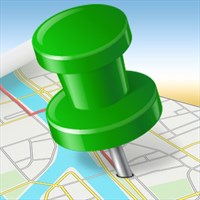

When I ride longer tours, I often use the mobile app of [LocaToWeb](https://locatoweb.com/user/mcpringle) and display my current position on this page. You can then follow me live here, send me messages and look at my photos right after I took them.

## Actual live broadcast event

Currently, there is no live broadcast. The next trip with live broadcasting starts on May 17th and will be linked here. The journey will go from Lucerne via Bern, Geneva, Grenoble, and Avignon to Barcelona and via Marseille, Nice, Monaco, Saint-Tropez, San Remo, Milan and Gotthard Pass back to Lucerne.

<!--
[  
Show current position](https://locatoweb.com/map/single/0716172140)
-->
