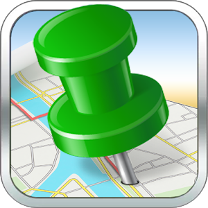

When I ride longer tours, I often use the mobile app of [LocaToWeb](https://locatoweb.com/user/mcpringle) and display my current position on this page. You can then follow me live here, send me messages and look at my photos right after I took them.

## Actual live broadcast event

I am on a new tour! The actual journey will go from Lucerne via Bern, Geneva, Grenoble, and Avignon to Barcelona and via Marseille, Nice, Monaco, Saint-Tropez, San Remo, Milan and Gotthard Pass back to Lucerne. Please click the icon below to get access to my actual position. It will be updated every few seconds when I move and mobile internet access is available. If you want more detailed information about this travel, [please read my article about it](/Barcelona/). Besides the live map, I'll add some articles about my travel to my blog, [please check it out](/).

[  
Show current position](https://locatoweb.com/map/single/0509174878)
